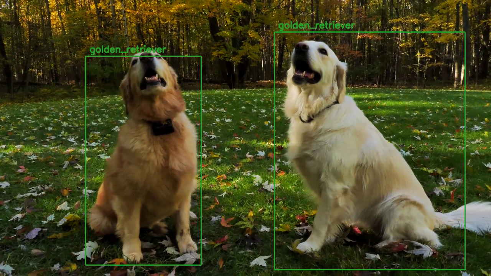

# Dog Breeds Classifier

## Overvies
Detect dogs in real time and discriminate breeds.  

## Usage
```
pip3 install -r requirements.txt
python3 app.py [video=path/to/video]
```

## Model Files
Download from below.
* [model_8.h5](https://www.dropbox.com/s/ol3w28b8onl23xa/model_8.h5?dl=0)  
* [model_16.h5](https://www.dropbox.com/s/btpeb738uk3mikq/model_16.h5?dl=0)  
* [yolo.h5](https://www.dropbox.com/s/kozt3gbk5l5ucde/yolo.h5?dl=0)  

## Introduction Slides
* [slides](https://docs.google.com/presentation/d/1l0LN2YL9Yo8Kis8--WkkkermDjyC0KMCYUctEZanW28/edit?usp=sharing)

## Flowchart


## Directory Structure
```
.
├── README.md
├── app.py
├── app_widget.py
├── icon.png
├── model
│   ├── breeds_8.txt
│   ├── breeds_16.txt
│   ├── cfg
│   │   ├── darknet53.cfg
│   │   └── yolov3.cfg
│   ├── classification
│   │   ├── [model_8.h5]
│   │   ├── [model_16.h5]
│   │   ├── train_8.pdf
│   │   ├── train_16.pdf
│   │   └── train.ipynb
│   ├── data
│   │   ├── crop
│   │   │   └── beagle
│   │   │       ├── beagle_000_0.jpg
│   │   │       ├── beagle_001_0.jpg
│   │   │       └── ...
│   │   └── raw
│   │       └── affenpinscher
│   │           ├── affenpinscher_000.jpg
│   │           ├── affenpinscher_001.jpg
│   │           └── ...
│   ├── font
│   │   ├── FiraMono-Medium.otf
│   │   └── SIL Open Font License.txt
│   ├── model.py
│   ├── sample
│   │   ├── sample.jpg
│   │   └── sample.mp4
│   ├── yolo
│   |   ├── convert.py
│   |   ├── yolo.py
│   |   ├── yolo_data
│   |   │   ├── coco_classes.txt
│   |   │   ├── [yolo.h5]
│   |   │   └── yolo_anchors.txt
│   |   ├── yolo_model.py
│   |   └── yolo_utils.py
|   └── yolo_crop.py  
├── requirements.txt
├── search.py
├── sex_classifier
│   ├── haarcascade_frontalface_default.xml
│   ├── make_model.ipynb
│   ├── make_model.py
│   ├── model.h5
│   ├── sex_classification_webcam.ipynb
│   ├── sex_classification_webcam.py
│   └── sex_classification_webcam_qt.py
└── translation.gs
```

## Screenshots

